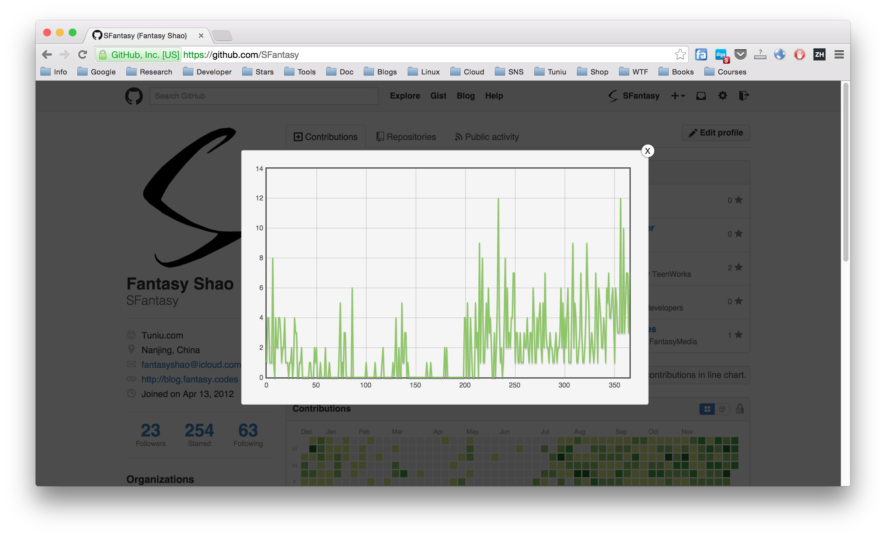

Contribution Chart
---

Chrome extension to view Github contributions in line-chart by [Flot](http://www.flotcharts.org/)

## Install

- Download on the extension [here](http://7b1exy.com1.z0.glb.clouddn.com/contribution-chart.crx)
- Drag the `.crx` file into your Chrome

## Screenshot

## License

The [MIT License](http://opensource.org/licenses/MIT)
